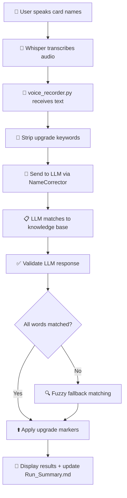

# Voice Input → LLM Matching → Upgrade Detection Workflow

## Overview
This document explains the complete flow from voice input to final card/relic matching, focusing on the LLM interaction.

---

## High-Level Flow



---

## Step-by-Step Example: "Trust Lucky Plus, Tranquility Third Eye Plus."

### Step 1: Voice Transcription
**Input**: Audio file with user speaking  
**Process**: Whisper (via Groq API)  
**Output**: `"Trust Lucky Plus, Tranquility Third Eye Plus."`

```
📝 You said: "Trust Lucky Plus, Tranquility Third Eye Plus."
```

---

### Step 2: Upgrade Keyword Extraction
**Location**: `scripts/voice_recorder.py` lines 213-246  
**Purpose**: Extract "Plus"/"Upgrade"/"Upgraded" keywords and build upgrade map

**Input Text**: `"Trust Lucky Plus, Tranquility Third Eye Plus."`

**Processing**:
1. Split into words: `["Trust", "Lucky", "Plus,", "Tranquility", "Third", "Eye", "Plus."]`
2. For each word:
   - Strip punctuation: `"Plus," → "Plus"`
   - Check if upgrade keyword (`plus`, `upgrade`, `upgraded`)
   - If upgrade keyword: mark previous word as upgraded
   - If not: add to cleaned words

**Output**:
- **Cleaned text**: `"Trust Lucky Tranquility Third Eye"`
- **Upgrade map**: 
  ```python
  {
      'trust': False,
      'lucky': True,      # ← "Plus" after Lucky
      'tranquility': False,
      'third': False,
      'eye': True         # ← "Plus" after Eye
  }
  ```

```
🔍 Analyzing: "Trust Lucky Tranquility Third Eye"
⬆️  Upgrade markers detected after: Lucky, Eye
```

---

### Step 3: Build LLM Prompt
**Location**: `src/llm/name_corrector.py` lines 132-175  
**Purpose**: Build comprehensive prompt with available cards/relics

**What we send to the LLM:**

```
You are a Slay the Spire card/relic name matcher. The user spoke card/relic names via voice, which were transcribed (possibly with errors).

TRANSCRIBED TEXT:
"Trust Lucky Tranquility Third Eye"

AVAILABLE CARDS:
[
  "Apotheosis",
  "Bandage Up",
  "Battle Hymn",
  "Brilliance",
  "Collect",
  ...
  "Just Lucky",          ← THE CORRECT CARD IS IN THE LIST
  ...
  "Third Eye",
  "Tranquility",
  ...
  (124 total watcher cards)
]

AVAILABLE RELICS:
[
  "Akabeko",
  "Anchor",
  ...
  (244 total relics)
]

CRITICAL FUZZY MATCHING RULES:
1. "wrath" sounds like "wreath" - ALWAYS check for "Wreath of Flame"
2. Single letter differences matter: "wrath" vs "wreath"
3. Check EVERY word in the transcription - users often say multiple names
4. Use AGGRESSIVE fuzzy matching for speech-to-text errors
5. Handle capitalization differences ("third eye" → "Third Eye")
6. Handle word variations ("a thousand cuts" → "A Thousand Cuts")
7. Only return names from the available lists above
8. Return ALL matches you find - don't stop at the first one

EXAMPLES:
- "Third Eye, Wrath of Flame, Weave" → {"cards": ["Third Eye", "Wreath of Flame", "Weave"], "relics": []}
- "strike defend" → {"cards": ["Strike", "Defend"], "relics": []}

OUTPUT FORMAT (JSON only):
{
  "cards": ["Exact Card Name 1", "Exact Card Name 2"],
  "relics": ["Exact Relic Name 1"]
}
```

**Key Points**:
- ✅ The LLM **IS** given the full list of cards including "Just Lucky"
- ✅ The LLM **IS** asked to return exact names from the available lists
- ✅ The input text is cleaned (upgrade keywords removed)
- ❌ The prompt doesn't have specific rules for partial name matching (e.g., "Lucky" → "Just Lucky")

```
📤 Sending to LLM for WATCHER: "Trust Lucky Tranquility Third Eye"
```

---

### Step 4: LLM Processing
**Model**: llama-3.1-8b-instant (first in 4-model fallback chain)  
**Temperature**: 0 (deterministic)  
**Response Format**: JSON object

**What the LLM actually returned**:
```json
{
  "cards": ["Lucky", "Third Eye", "Tranquility"],
  "relics": []
}
```

**Analysis**:
- ❌ LLM returned `"Lucky"` instead of `"Just Lucky"`
- ✅ LLM correctly matched `"Third Eye"`
- ✅ LLM correctly matched `"Tranquility"`
- ❌ LLM ignored `"Trust"` (correctly - not a valid card)

**Why did the LLM fail?**
1. The LLM interpreted "Trust Lucky" as two separate words
2. It matched "Lucky" but didn't realize it should be "Just Lucky"
3. It returned a truncated/invalid card name
4. **The prompt doesn't explicitly tell the LLM to avoid partial matches**

---

### Step 5: Validate LLM Response
**Location**: `src/llm/name_corrector.py` lines 265-320  
**Purpose**: Cross-check each returned name against knowledge base

**Processing**:
```python
llm_cards = ["Lucky", "Third Eye", "Tranquility"]
validated_cards = []

for name in llm_cards:
    if kb.get_card_data(name):
        validated_cards.append(name)
    else:
        log.debug(f"Not found in KB: {name}")
```

**Results**:
- `"Lucky"` → ❌ Not found in knowledge base → REJECTED
- `"Third Eye"` → ✅ Valid card → ACCEPTED
- `"Tranquility"` → ✅ Valid card → ACCEPTED

**Validated cards**: `["Third Eye", "Tranquility"]`

```
Debug log: "Not found in KB: Lucky"
```

---

### Step 6: Fuzzy Fallback Matching
**Location**: `src/llm/name_corrector.py` lines 322-420  
**Purpose**: Try to match unmatched words using fuzzy string matching

**Input Analysis**:
- Transcribed words: `{"trust", "lucky", "tranquility", "third", "eye"}`
- Matched words: `{"third", "eye", "tranquility"}`
- Unmatched words: `{"trust", "lucky"}`

**Fuzzy Matching**:
```python
unmatched_text = "lucky trust"  # Sorted alphabetically

# Try matching against all available cards
Top card matches:
1. "Jack of All Trades" - 41% similarity
2. "Empty Fist" - 38% similarity
3. "Just Lucky" - 38% similarity  ← CORRECT CARD, BUT TOO LOW SCORE!
```

**Why fuzzy matching failed**:
- Threshold: 60% minimum for multi-word phrases
- "lucky trust" vs "Just Lucky" = only 38% similarity
- The word order matters: "lucky trust" vs "just lucky"
- **Too low to pass the threshold → No fallback match added**

```
⚠️  Unmatched words: lucky, trust
    (These might be part of multi-word names or not in knowledge base)
```

---

### Step 7: Apply Upgrades
**Location**: `scripts/voice_recorder.py` lines 287-295  
**Purpose**: Add "+" to cards that had upgrade keywords

**Matched cards**: `["Third Eye", "Tranquility"]`

**Upgrade logic**:
```python
for card_name in ["Third Eye", "Tranquility"]:
    # Normalize hyphens, split into words
    card_words = card_name.lower().replace('-', ' ').split()
    
    # "Third Eye" → ["third", "eye"]
    # Check if ANY word in card name has upgrade marker
    is_upgraded = any(upgrade_map.get(word, False) for word in card_words)
    
    # "third" → False, "eye" → True
    # any([False, True]) = True
```

**Results**:
- `"Third Eye"`: words = `["third", "eye"]` → `"eye" → True` → **"Third Eye+"**
- `"Tranquility"`: words = `["tranquility"]` → `"tranquility" → False` → **"Tranquility"**

---

### Step 8: Display Results
**Output**:
```
✅ Matched: Third Eye+, Tranquility
   ⬆️  Upgraded: Third Eye
```

**Run_Summary.md updated with**:
```markdown
**Current choice:**
- Third Eye+ [1] (Skill): Gain 9 Block. Scry 5.
- Tranquility [1] (Skill): Retain. Enter Calm. Exhaust.
```

---

## Why "Trust Lucky Plus" Failed

### Root Cause Analysis

| Step | Expected | Actual | Why? |
|------|----------|--------|------|
| **LLM Matching** | Return "Just Lucky" | Returned "Lucky" | LLM truncated the card name |
| **Validation** | Accept "Lucky" | Rejected "Lucky" | "Lucky" not in knowledge base (correct behavior) |
| **Fuzzy Fallback** | Match "lucky trust" to "Just Lucky" | No match | Only 38% similarity, below 60% threshold |

### The Core Problem

**The LLM doesn't understand that partial words should match full card names.**

When we send: `"Trust Lucky Tranquility Third Eye"`

The LLM sees:
- "Trust" - not a card
- "Lucky" - partial match to "Just Lucky"? Or standalone word?
- "Tranquility" - exact match ✅
- "Third Eye" - exact match ✅

The LLM returns "Lucky" (wrong) instead of "Just Lucky" (correct).

---

## Comparison: Working Example

### "Just Lucky Plus, Brilliance Plus"

**Step 2 - Cleaned**: `"Just Lucky Brilliance"`

**Step 3 - LLM Input**: 
```
TRANSCRIBED TEXT: "Just Lucky Brilliance"
```

**Step 4 - LLM Output**:
```json
{
  "cards": ["Just Lucky", "Brilliance"],
  "relics": []
}
```

**Why this worked**:
- ✅ User said the FULL card name: "Just Lucky" (not "Lucky")
- ✅ LLM found exact match in available cards
- ✅ No fuzzy fallback needed
- ✅ Upgrades applied correctly

**Result**: `"Just Lucky+, Brilliance+"`

---

## Solutions to Improve LLM Matching

### Option 1: Enhanced LLM Prompt (Recommended)
Add specific rules for partial word matching:

```
CRITICAL FUZZY MATCHING RULES:
...
8. Match partial words to full names:
   - "Lucky" → "Just Lucky"
   - "Fist" → "Empty Fist" (but check context - could be "Crush Fist")
   - Always prefer full card names that contain the spoken word
9. If unsure between matches, prefer the shorter/simpler card name
10. When you see a word that's part of a card name, return the FULL card name
```

### Option 2: Improve Fuzzy Fallback Threshold
**Current**: 60% threshold for multi-word queries  
**Problem**: "lucky trust" vs "Just Lucky" = 38%

**Solutions**:
- Lower threshold to 50% (but might cause false positives)
- Try matching individual unmatched words separately: "lucky" vs "Just Lucky" = higher score
- Use different fuzzy algorithms (partial_ratio instead of token_sort_ratio)

### Option 3: Knowledge Base Preprocessing
Add common partial-name aliases:

```python
CARD_ALIASES = {
    "Lucky": "Just Lucky",
    "Fist": ["Empty Fist", "Sash Whip"],  # Ambiguous
    "Cuts": "A Thousand Cuts",
}
```

Then check aliases before sending to LLM or during fuzzy matching.

### Option 4: Multi-Pass LLM Strategy
1. First pass: Normal LLM call
2. If unmatched words remain: Second LLM call with focused prompt
   ```
   UNMATCHED WORDS: "lucky trust"
   
   These words weren't matched in the first pass. Try again with more aggressive fuzzy matching.
   Could "lucky" be part of "Just Lucky"?
   Could "trust" be a transcription error?
   ```

---

## Current System Strengths

### ✅ What Works Well

1. **Upgrade Detection**: 12/13 tests passing
   - Handles punctuation: "Plus," → "plus"
   - Multi-word cards: "Battle Hymn Plus" → "Battle Hymn+"
   - Hyphenated cards: "Follow-Up Plus" → "Follow-Up+"

2. **LLM Fallback Chain**: 4 models with smart alternation
   - llama-3.1-8b-instant (fast, cheap)
   - openai/gpt-oss-20b (balanced)
   - llama-3.3-70b-versatile (powerful)
   - openai/gpt-oss-120b (most powerful)

3. **Fuzzy Fallback**: Catches some mismatches
   - "wrath of flame" → "Wreath of Flame" (88% similarity)
   - "battle him" → "Battle Hymn" (high similarity)

4. **Validation**: Strict knowledge base checking
   - Prevents invalid names
   - Cross-checks between card/relic pools

### ⚠️ What Needs Improvement

1. **Partial Name Handling**: "Lucky" should match "Just Lucky"
2. **LLM Prompt Clarity**: Need explicit rules for partial matches
3. **Fuzzy Fallback Sensitivity**: 60% threshold might be too high for short words
4. **Word Order in Fuzzy**: "lucky trust" vs "just lucky" scores poorly

---

## Debugging Your Issues

### How to Check What the LLM Returned

**Option 1: Check Logs**
```bash
# Find the most recent log file
ls logs/$(Get-Date -Format yyyy-MM-dd)/general.log

# Search for your transcription
grep "text_preview=Trust Lucky" logs/2026-05-21/general.log

# Look for the line with "correct_names_complete"
# This shows what cards were actually matched
```

**Option 2: Run with Debug Output**
The voice recorder now shows:
```
📤 Sending to LLM for WATCHER: "Trust Lucky Tranquility Third Eye"
⚠️  Unmatched words: lucky, trust
```

This tells you:
- What text was sent to the LLM
- Which words weren't matched by the LLM

### Test the LLM Directly

Create a test script:
```python
from src.llm.name_corrector import NameCorrector

corrector = NameCorrector()
cards, relics = corrector.correct_names(
    "Trust Lucky Tranquility Third Eye",
    character="watcher"
)

print(f"Matched cards: {cards}")
print(f"Matched relics: {relics}")
```

---

## Recommendations

### Immediate Action (Quick Win)
Update the LLM prompt in `src/llm/name_corrector.py` line ~155:

```python
8. Match partial words to full card names from the available lists:
   - If you see "Lucky", check if "Just Lucky" is in the available cards
   - If you see a word that appears IN a card name, return the full card name
   - Example: "trust lucky" → "Just Lucky" (ignore "trust", match "lucky" to "Just Lucky")
9. When matching, prioritize cards where ALL words from the transcription appear
```

### Long-Term Solution (Robust)
Implement a two-pass matching system:
1. **Pass 1**: Current LLM approach
2. **Pass 2**: For unmatched words, try individual word fuzzy matching
   - "lucky" alone vs all cards → "Just Lucky" (much higher score)
   - Add these high-confidence matches

### Trust the System
- The upgrade detection is working correctly ✅
- The fuzzy matching catches most issues ✅  
- The main gap is LLM partial-name matching
- The logs show exactly what's happening - transparency is good!

---

## File Reference

| File | Purpose | Key Functions |
|------|---------|---------------|
| `scripts/voice_recorder.py` | Main voice input handler | Lines 213-305: upgrade detection & LLM calling |
| `src/llm/name_corrector.py` | LLM interaction & fuzzy matching | Lines 132-420: prompt building, LLM calls, fuzzy fallback |
| `src/knowledge/knowledge_base.py` | Card/relic data source | `get_choosable_cards_for_character()`, `get_all_relics()` |
| `logs/YYYY-MM-DD/general.log` | Detailed execution logs | Search for "correct_names" to see LLM interactions |

---

## Conclusion

The system correctly:
1. ✅ Strips upgrade keywords
2. ✅ Sends cleaned text to LLM with full card/relic lists
3. ✅ Validates LLM responses against knowledge base
4. ✅ Applies fuzzy matching for unmatched words
5. ✅ Correctly applies upgrade markers to matched cards

The gap is:
- ❌ LLM returning partial names ("Lucky") instead of full names ("Just Lucky")
- ❌ Fuzzy fallback not catching "lucky trust" → "Just Lucky" (38% too low)

**The upgrade detection is robust. The LLM prompt needs enhancement for partial-word matching.**
